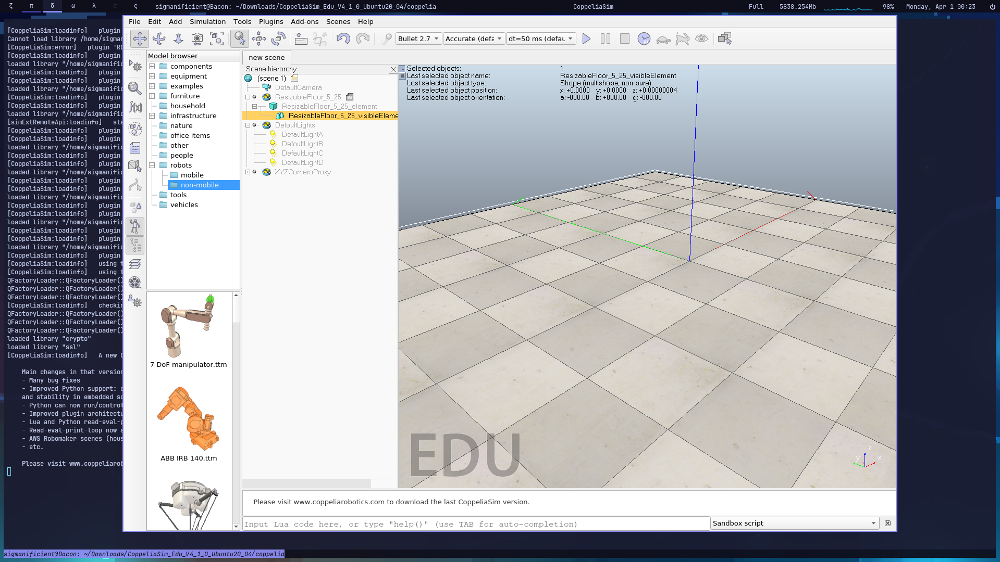

# Coppelia-nix

Minimal shell for coppeliaSim dependancies

## Usage

> Download the [archive](https://downloads.coppeliarobotics.com/V4_1_0/CoppeliaSim_Edu_V4_1_0_Ubuntu20_04.tar.xz) and extract it


```sh
nix develop github:Sigmapitech/coppelia-nix
```

Edit the `coppeliaSim.sh` shebang to `/usr/bin/env bash`.

```sh
./coppeliaSim.sh
```


